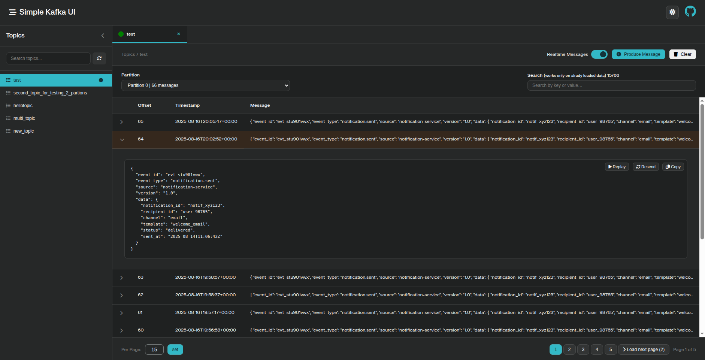
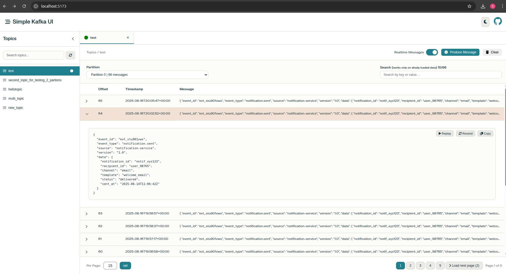

# 🚀 Simple Kafka UI

<div align="center">

[](http://unlicense.org/)
[](https://hub.docker.com/r/shantanuterang/simple-kafka-ui)
[](https://github.com/shantanu-terang/simple-kafka-ui/stargazers)
[](https://github.com/shantanu-terang/simple-kafka-ui/network)

**A modern, lightweight Kafka UI designed for developers who want simplicity without sacrificing functionality.**

*Stream, explore, and manage Kafka messages with real-time updates and an intuitive interface.*

[🐳 Docker Hub](https://hub.docker.com/r/shantanuterang/simple-kafka-ui) • [📚 Documentation](https://github.com/shantanu-terang/simple-kafka-ui/wiki) • [🐛 Report Bug](https://github.com/shantanu-terang/simple-kafka-ui/issues) • [✨ Request Feature](https://github.com/shantanu-terang/simple-kafka-ui/issues/new)

</div>

---

## ⭐ Why Choose Simple Kafka UI?

**Built for developers, by developers.** Unlike heavyweight enterprise tools, Simple Kafka UI focuses on what matters most: **quick setup**, **real-time streaming**, and **zero configuration complexity**.

🎯 **Perfect for:**
- Local Kafka development and testing
- Debugging message flows in real-time
- Quick topic exploration and message inspection
- Learning Kafka without tool overhead
- CI/CD pipeline integration

---

## ✨ Features That Make It Awesome

### 🔧 **Smart Topic Management**
- ⚡ Create topics with custom partitions and replication
- 📋 Auto-refresh topic list with metadata
- 🔍 Advanced filtering and search capabilities

### 📜 **Powerful Message Explorer**
- 🎯 Partition-aware message browsing
- 🔎 Fuzzy search across message content
- 📄 Paginated results for large datasets
- 🎨 JSON syntax highlighting and formatting

### 📡 **Real-time Streaming**
- ⚡ Live message streaming with Socket.IO
- 🔄 Multi-topic monitoring simultaneously  
- 🎮 Start/stop streaming with a single click
- 📊 Real-time message count updates

### ✍️ **Message Producer**
- 📝 Send messages to any partition
- 🔁 Resend previous messages with one click
- ⚙️ Custom headers and key support
- 📋 Message templates for common use cases

### 🎨 **Developer Experience**
- 🌗 Beautiful dark/light theme toggle
- 📱 Responsive design for all devices
- ⚡ Fast, modern React + TypeScript frontend
- 🔥 Hot-reload development environment

### 🐳 **Production-Ready Deployment**
- 🚀 Single Docker command setup
- ☁️ Multi-cloud support (Confluent, CloudKafka)
- 🔐 SASL authentication with multiple mechanisms
- 🏗️ Multi-stage Docker build optimization

---

## 🚀 Quick Start

### Option 1: Docker Compose (Recommended)
Get up and running in under 60 seconds:

```bash
# Clone the repository
git clone https://github.com/shantanu-terang/simple-kafka-ui.git
cd simple-kafka-ui

# Start everything (Zookeeper + Kafka + UI)
docker compose up
```

**🎉 That's it!** Open http://localhost:3000 and start exploring Kafka topics.

### Option 2: Connect to Existing Kafka
Already have Kafka running? Just connect to it:

```bash
# Create your config
cp config.json.example config.json
# Edit config.json with your Kafka details

# Run the UI
docker run -p 3000:3000 -v $(pwd)/config.json:/app/config.json shantanuterang/simple-kafka-ui
```

### Option 3: Development Mode
For contributors and customization:

```bash
git clone https://github.com/shantanu-terang/simple-kafka-ui.git
cd simple-kafka-ui

# Development with hot reload
docker compose -f docker-compose.dev.yml up

# Frontend: http://localhost:5173
# Backend: http://localhost:3000
```

---

## 🖼️ Screenshots

<details>
<summary>🌙 <strong>Dark Mode</strong> - Perfect for late-night debugging sessions</summary>



*Clean, modern interface with syntax highlighting and real-time updates*

</details>

<details>
<summary>☀️ <strong>Light Mode</strong> - Easy on the eyes for daytime development</summary>



*Crisp, professional look with excellent readability*

</details>

---

## 🛠️ Technology Stack

<table>
<tr>
<td valign="top" width="50%">

### **Backend**
- **Express.js** - Fast, minimalist web framework
- **KafkaJS** - Pure JavaScript Kafka client
- **Socket.IO** - Real-time bidirectional communication
- **Node.js 22** - Latest LTS runtime

</td>
<td valign="top" width="50%">

### **Frontend**
- **React 19** - Latest React with concurrent features
- **TypeScript** - Type-safe development
- **Vite** - Lightning-fast build tool
- **Zustand** - Lightweight state management

</td>
</tr>
</table>

### **DevOps & Deployment**
- 🐳 **Multi-stage Docker builds** for optimized images
- 🚀 **Docker Compose** for local development
- ⚡ **GitHub Actions** for automated builds
- 📦 **Docker Hub** for easy distribution

---

## ⚙️ Configuration Examples

<details>
<summary>🏠 <strong>Local Development (No Auth)</strong></summary>

```json
{
  "clientId": "simple-kafka-ui",
  "brokers": ["kafka:9092", "localhost:29092"],
  "connectionTimeout": 5000
}
```

</details>

<details>
<summary>🔒 <strong>SASL Plain Authentication</strong></summary>

```json
{
  "clientId": "simple-kafka-ui",
  "brokers": ["localhost:9092"],
  "connectionTimeout": 5000,
  "sasl": {
    "mechanism": "plain",
    "username": "alice",
    "password": "alice-secret"
  }
}
```

</details>

<details>
<summary>☁️ <strong>Confluent Cloud</strong></summary>

```json
{
  "clientId": "simple-kafka-ui",
  "brokers": ["<your-cluster>.us-central1.gcp.confluent.cloud:9092"],
  "connectionTimeout": 5000,
  "ssl": true,
  "sasl": {
    "mechanism": "plain",
    "username": "your_api_key",
    "password": "your_api_secret"
  }
}
```

</details>

<details>
<summary>🌊 <strong>CloudKarafka</strong></summary>

```json
{
  "clientId": "simple-kafka-ui",
  "brokers": ["ark-01.srvs.cloudkafka.com:9094"],
  "authenticationTimeout": 10000,
  "reauthenticationThreshold": 10000,
  "ssl": true,
  "sasl": {
    "mechanism": "scram-sha-256",
    "username": "your_username",
    "password": "your_password"
  }
}
```

</details>

---

## 🤝 Contributing

We love contributions! Whether it's a bug fix, new feature, or documentation improvement.

### 🚀 **Quick Contribution Guide**

1. **🍴 Fork** the repository
2. **🌿 Create** your feature branch (`git checkout -b feature/awesome-feature`)
3. **💾 Commit** your changes (`git commit -m 'Add awesome feature'`)
4. **📤 Push** to the branch (`git push origin feature/awesome-feature`)
5. **🎯 Open** a Pull Request

### 🐛 **Found a Bug?**
[Create an issue](https://github.com/shantanu-terang/simple-kafka-ui/issues/new) with:
- Steps to reproduce
- Expected vs actual behavior
- Your environment details
- Screenshots (if applicable)

### 💡 **Have an Idea?**
We'd love to hear it! [Open a feature request](https://github.com/shantanu-terang/simple-kafka-ui/issues/new) and tell us about your use case.

---

## 📊 Project Stats

<div align="center">


</div>

---

## 🎯 Roadmap

### 🚧 **Coming Soon**
- [ ] **Message Schema Registry** support
- [ ] **Consumer Group** monitoring and management  
- [ ] **Topic Configuration** editing
- [ ] **Message Export** (JSON, CSV, Avro)
- [ ] **Custom Deserializers** (Avro, Protobuf)
- [ ] **Cluster Metrics** dashboard
- [ ] **Multi-cluster** support

### 💭 **Future Ideas**
- [ ] **Kafka Connect** integration
- [ ] **KSQL** query interface
- [ ] **Message Replay** functionality
- [ ] **Performance Benchmarking** tools

> 🗳️ **Vote** on features or suggest new ones in our [GitHub Discussions](https://github.com/shantanu-terang/simple-kafka-ui/discussions)!

---

## 🎓 Learning Resources

### 📚 **New to Kafka?**
- [Apache Kafka Documentation](https://kafka.apache.org/documentation/)
- [Confluent Kafka Tutorials](https://kafka-tutorials.confluent.io/)
- [KafkaJS Documentation](https://kafka.js.org/)

### 🔧 **Development Resources**
- [Docker Compose Reference](https://docs.docker.com/compose/)
- [React + TypeScript Guide](https://react.dev/learn/typescript)
- [Socket.IO Documentation](https://socket.io/docs/v4/)

---

## 📌 Important Notes

> ⚠️ **Development Focus**: This project is optimized for **local development and testing**. For production Kafka management, consider enterprise solutions like Confluent Control Center or Kafdrop.

> 🔐 **Security**: Always use proper authentication and network security when connecting to production Kafka clusters.

> 🐛 **Issues**: Found a problem? Check our [troubleshooting guide](https://github.com/shantanu-terang/simple-kafka-ui/wiki/Troubleshooting) first.

---

## ❤️ Support This Project

If Simple Kafka UI helps your development workflow:

- ⭐ **Star this repository** to show your support
- 🍴 **Fork** and contribute to make it even better  
- 🐛 **Report bugs** to help us improve
- 💬 **Share** with your fellow developers
- 📝 **Write** about your experience using it

---

## 📜 License

This software is released into the **public domain** under The Unlicense. 

**Use it freely** - copy, modify, publish, distribute, sell, or use commercially without any restrictions or requirements.

<div align="center">

**Built with ❤️ for the Kafka community**

---

📫 **Questions?** [Open an issue](https://github.com/shantanu-terang/simple-kafka-ui/issues) or [start a discussion](https://github.com/shantanu-terang/simple-kafka-ui/discussions)

</div>